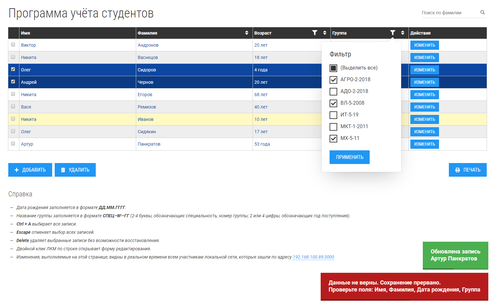

# Defa test project - part 2

#### Установка
1. Установить [Node.js](https://nodejs.org/en/download/).
2. Скачать или клонировать этот репозиторий.
3. Запустить `start.bat` из корня проекта. При первом запуске будет произведена установка необходимых модулей - дождитесь окончания процесса.

    3.1. Для ОС, отличающихся от Windows: вместо `start.bat` перейти через командную строку в папку проекта и вызвать `npm run build` (для установки) и `npm start` (для запуска).
    
4. Перейти по адресу `http://localhost:3000`.

#### Справка

- Дата рождения заполняется в формате ДД.ММ.ГГГГ.
Название группы заполняется в формате СПЕЦ–№–ГГ (2-4 буквы, обозначающих специальность; номер группы; 2 или 4 цифры, обозначающих год поступления).
- Ctrl + A выбирает все записи.
- Escape отменяет выбор всех записей.
- Delete удаляет выбранные записи без возможности восстановления.
- Двойной клик ЛКМ по строке открывает форму редактирования.
- Изменения, выполняемые в этом приложении, видны в реальном времени всем участникам локальной сети, которые зашли по адресу сервера.

